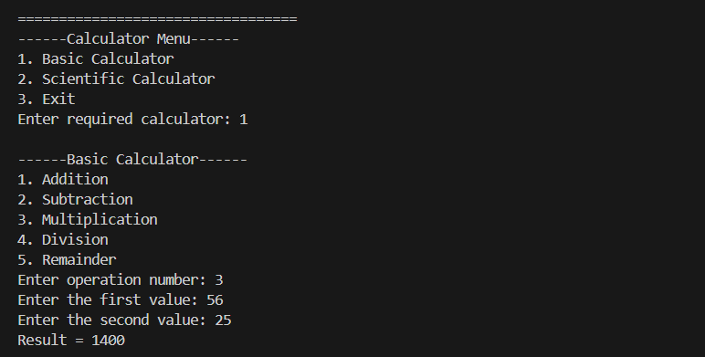
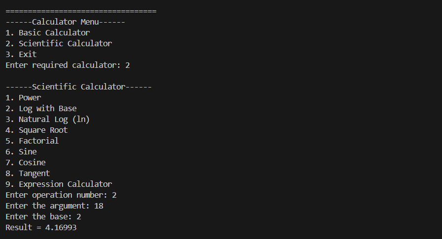
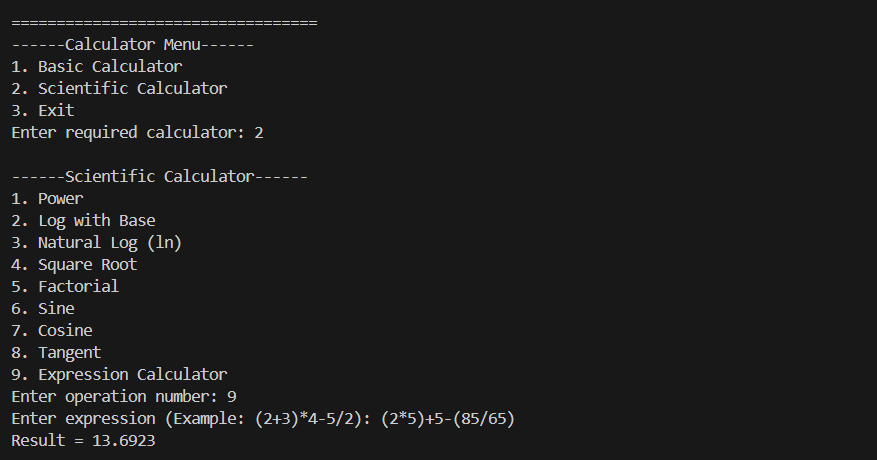
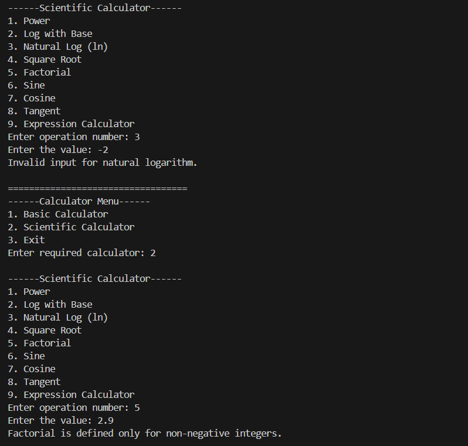
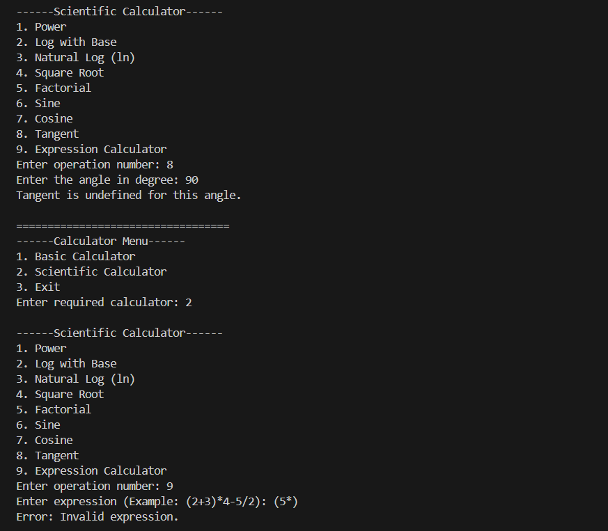

# Scientific Calculator (C++)

A feature-rich **Scientific Calculator** built in **C++** using Object-Oriented Programming (OOP). The project supports both basic arithmetic and scientific functions with a modular code structure using separate `include` and `src` directories.

## Features

### Basic Operations
- Addition
- Subtraction
- Multiplication
- Division
- Modulus

### Scientific Operations
- Square Root
- Power
- Exponential
- Logarithm (log, log10)
- Trigonometric Functions
  - sin()
  - cos()
  - tan()

### Expression Evaluation
- Supports complete mathematical expressions
- Operator precedence
- Parentheses support
- Unary minus support
- Error handling for invalid expressions

### Error Handling
- Division by zero
- Invalid input
- Invalid mathematical expressions

---

## Folder Structure

```
Scientific-Calculator/
│
├── include/
│   ├── Calculator.h
│   ├── BasicCalculator.h
│   ├── ScientificCalculator.h
│   └── ExpressionEvaluator.h
│
├── src/
│   ├── BasicCalculator.cpp
│   ├── ScientificCalculator.cpp
│   ├── ExpressionEvaluator.cpp
│   └── main.cpp
│
├── screenshots/
│
├── .gitignore
├── README.md
└── LICENSE (optional)
```

---

## Technologies Used

- C++
- Object-Oriented Programming (OOP)
- Standard Template Library (STL)

---

## Build Instructions

### Using g++

Compile the project using:

```bash
g++ src/*.cpp -I include -o calculator
```

Run the executable:

### Windows

```bash
calculator.exe
```

### Linux / macOS

```bash
./calculator
```

---

## Sample Output

```
========== Scientific Calculator ==========
1. Basic Operations
2. Scientific Operations
3. Expression Evaluation
4. Exit

Enter your choice:
```

---

## Screenshots

### Main Menu


### Basic Operations



### Scientific Operations



### Expression Evaluation



### Error Handling





---

## Future Improvements

- Unit converter
- Matrix operations
- History feature

---

## Author

**Arpit Singh Chauhan**

GitHub: https://github.com/Arpit-Singh-Chauhan